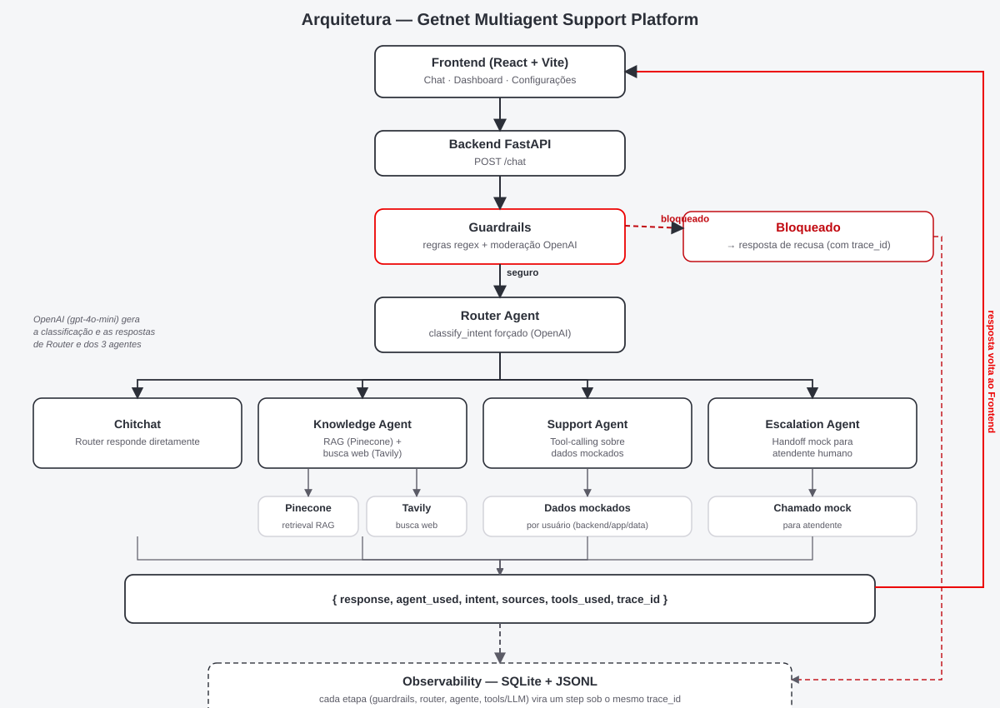

# Getnet Multiagent Support Platform

Uma plataforma de atendimento ao cliente com IA multiagente para a Getnet:
um backend de orquestração em FastAPI (guardrails → router → agentes de
knowledge/support/escalation) mais um frontend SaaS em React/TypeScript para
conversar com ela e observar como a orquestração se comportou.

- **Backend**: `backend/` — Python 3.12, FastAPI, LangChain, Pinecone, Tavily, OpenAI.
- **Frontend**: `frontend/` — React 19, TypeScript, Vite, Tailwind CSS v4.

---

## 1. Como rodar

### 1.1 Com Docker (só o backend)

```bash
cp backend/.env.example backend/.env
# preencha OPENAI_API_KEY, PINECONE_API_KEY, PINECONE_ENVIRONMENT,
# PINECONE_INDEX_NAME, TAVILY_API_KEY em backend/.env

docker compose up --build
```

Isso builda e sobe o backend em `http://localhost:8000`. Para testar:

```bash
curl -X POST http://localhost:8000/chat \
  -H "Content-Type: application/json" \
  -d '{"message": "oi, tudo bem?", "user_id": "user-1"}'
```

A imagem Docker inclui a suíte `tests/` e as dependências de desenvolvimento,
então a página **Testes** do frontend (que dispara `POST /tests/run`, um
subprocesso `pytest` real) também funciona contra o backend containerizado,
não só contra um ambiente local.

### 1.2 Frontend

O frontend não faz parte do `docker-compose.yml` (só o backend faz, por
escopo) — rode-o com Node/npm, apontado para o backend:

```bash
cd frontend
cp .env.example .env   # VITE_API_BASE_URL=http://localhost:8000
npm install
npm run dev
```

Abra `http://localhost:5173`.

---

## 2. Desenvolvimento local (sem Docker)

### 2.1 Backend

Requer Python 3.12 (um venv 3.13 também funciona para dev/testes locais; a
imagem Docker fixa 3.12 exatamente, conforme o requisito de stack do desafio).

```bash
cd backend
python3.12 -m venv .venv && source .venv/bin/activate
pip install -r requirements-dev.txt   # inclui requirements.txt + ferramentas de pytest
cp .env.example .env                  # preencha com credenciais reais
uvicorn app.main:app --reload
```

Rode a ingestão do RAG uma vez (cria o índice Pinecone se ele não existir,
gera embeddings e envia o corpus da Getnet — ver §5):

```bash
python -m app.rag.ingest
```

### 2.2 Frontend

```bash
cd frontend
npm install
npm run dev
```

---

## 3. Testes

### 3.1 Backend (pytest)

```bash
cd backend
source .venv/bin/activate
pytest                 # suíte completa
pytest tests/test_guardrails.py tests/test_router.py   # um subconjunto
```

A suíte cobre, por agente/tool com o LLM mockado, além de caminhos de
integração reais:

- Guardrails (regras regex + moderação, tanto bloqueio quanto passagem)
- Router (chamada forçada da tool `classify_intent`, resposta direta de
  chitchat, dispatch)
- Knowledge Agent (caminho RAG, fallback de busca web, fallback de "sem resposta")
- Support Agent (cada uma das suas 5 tools, escopo de dados por usuário,
  fallback de usuário desconhecido)
- Escalation Agent (chamada mock de handoff, resposta, captura de observabilidade)
- Contrato de `POST /chat` (validação, consistência do envelope)
- Observabilidade (logger JSONL, índice/store SQLite, coerência do trace ponta a ponta)
- APIs de leitura de observabilidade (`/conversations`, `/conversations/{id}/trace`, `/metrics`, `/agents/usage`, `/tokens/usage`)
- Store de configuração dos agentes + sua API de leitura/escrita/restauração de padrão
- A própria API do executor de testes (`/tests/run`)
- **Um teste ponta a ponta contra os 10 casos de exemplo do desafio, rodado
  ao vivo contra OpenAI/Pinecone/Tavily reais** (pulado automaticamente se
  `backend/.env` não tiver credenciais configuradas)

A mesma suíte também pode ser executada pela página **Testes** do frontend,
que chama `POST /tests/run` e mostra o resultado numa interface estilo
terminal — incluindo um botão dedicado **"Executar todos os testes"** além
da opção de rodar uma categoria específica.

### 3.2 Frontend (Vitest + Testing Library)

```bash
cd frontend
npm test        # vitest run
```

Toda página tem testes de componente com o cliente da API mockado
(renderização de mensagens, estados de processamento, fontes condicionais,
o painel de fluxo do agente ao vivo, refetch por filtro de período, busca de
conversas com múltiplos filtros, o fluxo clicável de erro até o trace, salvar/restaurar prompt, e a interface do executor de testes).

---

## 4. Arquitetura



### 4.1 Fluxo de uma mensagem

```
POST /chat { message, user_id }
        │
        ▼
  Guardrails (regras regex, depois moderação OpenAI)
        │  bloqueado? ──► resposta de recusa (trace_id presente, nenhum agente rodou)
        ▼ seguro
  Router Agent
        │  chamada forçada de tool: classify_intent → knowledge | support | escalation | chitchat
        │
        ├─ chitchat ──────────────► Router responde diretamente
        ├─ knowledge ─────────────► Knowledge Agent (RAG ou busca web)
        ├─ support ───────────────► Support Agent (tool-calling sobre dados mockados)
        └─ escalation ────────────► Escalation Agent (handoff humano mockado)
        │
        ▼
  { response, agent_used, intent, sources, tools_used, trace_id }
```

Toda requisição recebe um `trace_id` único (gerado antes dos guardrails
rodarem, então está presente mesmo numa rejeição), e cada etapa do caminho —
checagem de guardrail, classificação do router, geração do agente, cada
chamada de tool/LLM — é capturada como um step de observabilidade sob esse
mesmo `trace_id` (§8).

### 4.2 Por que um 5º pseudo-agente "guardrails"

`agent_used` pode ser `"guardrails"` quando uma mensagem é bloqueada antes de
chegar ao Router — isso mantém o contrato de resposta uniforme (sempre tem
um par `agent_used`/`intent`) em vez de um formato de erro tratado como caso
especial.

### 4.3 Identidade visual

Tema claro único (sem alternância para escuro — removida deliberadamente),
com as cores reais do site da Getnet: fundo branco/cinza claro
(`#FFFFFF`/`#F5F6F8`, conferidas ao vivo em getnet.com.br, não estimadas), e
o vermelho da marca (`#EC0000`, confirmado no manual de marca) como acento
para a logo, ações primárias e destaques pontuais — nunca a cor dominante de
telas ou textos grandes. As séries de gráficos e badges usam só essa família
de vermelho mais tons neutros de cinza-chumbo (`frontend/src/lib/theme.ts`)
— uma paleta neon estimada (amarelo/rosa/roxo/ciano/lima) foi usada num
rascunho anterior e removida depois de confirmar que a Getnet não tem essas
cores no manual de marca. Todas as cores são tokens CSS (`@theme`/variáveis
customizadas), nunca hardcoded por componente.

### 4.4 Estrutura do frontend (sidebar com 3 páginas)

A sidebar tem três itens, não cinco — duas das cinco páginas originais estão
embutidas como seções/abas de outra página em vez de rotas separadas:

- **Chat**: histórico com rolagem automática para a última mensagem, logo
  real da Getnet, sugestões rápidas configuráveis posicionadas acima do
  campo de envio (`lib/quickReplies.ts`), feedback 👍/👎 por mensagem da IA
  (renderizado fora do balão, junto com as fontes), e o painel de fluxo do
  agente ao vivo — rótulos amigáveis em português por padrão
  (`lib/stepLabels.ts`), com revelação progressiva em tempo real durante o
  processamento (os dois primeiros passos, que sempre acontecem, aparecem
  concluídos assim que terminam; o passo final mostra "consultando o agente
  responsável..." até a resposta chegar, já que qual agente responde só é
  conhecido nesse momento) e um toggle opcional de "detalhes técnicos" para
  o nome bruto do step/modelo/tokens.
- **Dashboard**: métricas filtráveis por período (conversas, taxa de erro,
  latência média, tokens médios por conversa, custo estimado), gráficos de
  uso por agente/avaliação por agente/tokens, e a view completa de **Logs &
  Observabilidade** como uma seção recolhível no final da página (recolhida
  por padrão).
- **Configurações**: abas para **Agentes** (cards completos por agente:
  prompt, seletor de LLM/modelo, limite máximo de tokens, tools com toggle
  de desabilitar por tool, habilitar/desabilitar), **Prompts** (um editor
  focado com todos os prompts), **LLMs** (uma tabela compacta
  agente→modelo/max-tokens), e **Testes** (o executor de testes estilo
  terminal, com botão para rodar uma categoria ou todas de uma vez, embutido
  em vez de ter rota própria).

### 4.5 Organização do código

```
backend/app/
  main.py             App FastAPI + registro das rotas
  config.py           pydantic-settings (as 5 variáveis de ambiente obrigatórias)
  orchestrator.py      guardrails → router → dispatch, une tudo
  guardrails/          regras regex, moderação OpenAI, pipeline
  agents/               router.py, knowledge.py, support.py, escalation.py
  llm/                   wrappers finos de ChatOpenAI (LangChain) por agente
  tools/                 classify_intent, retrieval, web_search, support_tools, escalation_tool
  rag/                   corpus_sources.py, fetch.py, chunk.py, ingest.py, manifest.py
  data/                  dataset mockado por usuário (mock_users.py)
  observability/         modelo StepRecord, logger JSONL, store SQLite, recorder, pricing
  config_store/          store de configuração dos agentes em arquivo JSON (página Configurações)
  api/                    chat.py, conversations.py, metrics.py, agents_config.py, test_runner.py, feedback.py
  models/                 request/response em Pydantic v2 + dataclasses internas do pipeline

frontend/src/
  api/                   cliente tipado + types para cada endpoint do backend
  components/             chat/, dashboard/, logs/, settings/, tests/, layout/
  pages/                   ChatPage, DashboardPage, SettingsPage (embute LogsPage/TestsPage)
  hooks/                   useChat, useTestRun
  lib/                     quickReplies.ts, stepLabels.ts, theme.ts (série de cores dos gráficos), period.ts
```

---

## 5. Pipeline de RAG

**Ingestão → armazenamento → recuperação → geração**, tudo em
`backend/app/rag/` e `backend/app/agents/knowledge.py`.

1. **Ingestão** (`rag/ingest.py`, rodado via `python -m app.rag.ingest`):
   busca cada URL do corpus (`rag/corpus_sources.py`) com `httpx`, remove
   ruído de navegação/script/estilo com BeautifulSoup (`rag/fetch.py`), e
   divide o texto restante em blocos de ~1000 caracteres com 150 caracteres
   de sobreposição usando o `RecursiveCharacterTextSplitter` do LangChain
   (`rag/chunk.py`).
2. **Armazenamento**: os blocos recebem embedding com o
   `text-embedding-3-small` da OpenAI e são enviados a um índice serverless
   do Pinecone (criado automaticamente com `cloud="aws", region="us-east-1"`
   se ainda não existir) via `PineconeVectorStore` do `langchain-pinecone`,
   marcados com metadados `source_url` e `topic`.
3. **Recuperação** (`tools/retrieval.py`): o Knowledge Agent roda uma busca
   por similaridade top-k (`asimilarity_search_with_score`) contra o mesmo
   vector store para toda pergunta com intenção de knowledge.
4. **Geração** (`agents/knowledge.py`): se algum trecho recuperado passa de
   um limiar de relevância, o agente gera uma resposta fundamentada só
   nesses trechos (`RAG_SYSTEM_PROMPT`), citando a URL de cada fonte. Se
   nada passa do limiar — ou seja, a pergunta é julgada fora do escopo do
   corpus (clima, curiosidades gerais, etc.) — o agente chama a tool de
   busca web da Tavily (`tools/web_search.py`) e fundamenta a resposta
   nesses resultados. Se nem a busca web retornar algo útil, o agente diz
   que não pode responder em vez de inventar uma resposta.

### 5.1 Fontes ingeridas (manifest)

Produzido por `rag/manifest.py`, escrito em
`backend/data_store/rag_manifest.json` a cada execução de ingestão. Conteúdo
atual:

| URL | Tópico | Ingerido em | Chunks |
|---|---|---|---|
| https://www.getnet.net/en | institucional (fonte obrigatória) | 2026-08-23 | 5 |
| https://site.getnet.com.br/maquininha/get-classica/ | Get Clássica | 2026-08-23 | 5 |
| https://site.getnet.com.br/get-ajuda-maquininha/solucoes-get-smart/ | Get Smart | 2026-08-23 | 3 |
| https://site.getnet.com.br/link-de-pagamento/ | Payment Link | 2026-08-23 | 5 |
| https://site.getnet.com.br/get-ajuda-antecipacao-de-venda/como-antecipar-sua-vendas-pelo-app/ | Antecipação de recebíveis | 2026-08-23 | 3 |
| https://site.getnet.com.br/duvidas/ | FAQ | 2026-08-23 | 75 |
| https://site.getnet.com.br/link-de-pagamento-getnet/ | Blog (venda por Payment Link / WhatsApp) | 2026-08-23 | 5 |

Rode `python -m app.rag.ingest` novamente a qualquer momento para atualizar
essa tabela (tanto o arquivo JSON quanto o índice Pinecone são atualizados).

---

## 6. Como as tools de LLM foram usadas

| Tool | Usada por | Forçada? | Propósito |
|---|---|---|---|
| `classify_intent` | Router | **Sim** (`tool_choice`) | A intenção é sempre lida da saída estruturada dessa tool, nunca extraída de texto livre |
| `pinecone_retrieval` | Knowledge Agent | Não (sempre tentada primeiro) | Busca top-k de trechos contra o corpus ingerido |
| `tavily_web_search` | Knowledge Agent | Não (fallback) | Busca web ao vivo quando a recuperação não é relevante o suficiente |
| `get_settlement_schedule`, `get_transaction_status`, `get_device_status`, `get_account_info`, `get_installment_plan` | Support Agent | Não (o LLM escolhe 0+ delas) | Function-calling de verdade: o modelo decide quais consultas de dados mockados a pergunta precisa; os resultados são escopados no servidor pelo `user_id` da requisição (nunca fornecido pelo LLM) |
| `mock_handoff_call` / `mock_phone_transfer_call` | Escalation Agent | N/A (sempre uma das duas é chamada, não é uma tool de LLM) | Handoff externo mockado — fila no chat, ou 0800 + código quando o usuário pede explicitamente por telefone (escolhido por palavra-chave na mensagem, ver §9); confirmação determinística, sem chamada de LLM, para evitar detalhes de chamado alucinados |

O Support Agent é o exemplo mais claro de tool-calling aberto: ele vincula
as 5 tools numa única chamada ao `ChatOpenAI`, deixa o modelo escolher quais
(se alguma) se aplicam à pergunta, executa-as, e então alimenta os
resultados de volta como `ToolMessage`s numa segunda chamada para produzir a
resposta final.

### 6.1 `max_tokens` e `disabled_features` por agente (página Configurações)

A configuração de cada agente (`GET/PUT /agents/config/{agent}`) tem um
limite de `max_tokens` e uma lista `disabled_features`, ambos **aplicados de
verdade no momento da requisição**, não só exibidos:

- **`max_tokens`** é repassado diretamente como o próprio parâmetro de
  máximo de tokens de saída da chamada `ChatOpenAI` — mas **só em chamadas
  de geração aberta** (resposta de chitchat, resposta de RAG/web, resposta
  final do Support), nunca numa chamada forçada ou de seleção de tool. A
  saída de uma chamada de tool é um JSON estruturado pequeno; limitá-la
  demais pode truncar os argumentos no meio do JSON e quebrar o parsing
  inteiro em vez de só encurtar uma resposta — isso foi um bug real
  encontrado em teste ao vivo
  (`tests/test_llm_enforcement.py::test_router_classify_intent_call_is_never_capped`).
  Quando uma chamada atinge seu limite, o status do seu step de
  observabilidade vira `"truncated"` em vez de `"ok"`, ficando visível em
  Logs/Dashboard.
- **`disabled_features`** guarda nomes de tools (os mesmos nomes exibidos no
  card de cada agente, ex.: `tavily_web_search`, `get_installment_plan`)
  que o agente não deve usar. O Knowledge Agent pula a Tavily por completo
  quando `tavily_web_search` está desabilitada (caindo para a resposta de
  "sem resposta" se o RAG também não achar nada); o Support Agent exclui
  qualquer tool desabilitada dos schemas vinculados à sua chamada de LLM,
  então o modelo nunca consegue selecioná-la.

Salvar qualquer um dos dois campos limpa o orquestrador em cache
(`get_orchestrator.cache_clear()` em `api/agents_config.py`), então a
mudança vale já na próxima requisição, sem precisar reiniciar.

---

## 7. Guardrails

`backend/app/guardrails/` — roda antes do Router, em toda mensagem:

1. **Regras regex** (`regex_rules.py`): um conjunto pequeno e curado —
   frases de prompt injection, pedidos de credenciais/API keys, padrões de
   número de cartão, e três frentes adicionais: tentativas de jailbreak
   ("burlar", "bypass", "modo sem restrições"), pedidos de dados de outro
   cliente/usuário (risco de vazamento entre contas), e ações que
   comprometeriam a integridade da plataforma (apagar/derrubar banco de
   dados, servidor, sistema). Barato, sem chamada de rede, checado primeiro.
2. **Moderação OpenAI** (`moderation.py`): só é alcançada se a regex passar,
   para evitar pagar por uma chamada de moderação em uma entrada que já
   seria bloqueada.

Qualquer uma das duas checagens falhando encerra a requisição com uma
resposta de recusa que ainda carrega um `trace_id` novo e um step de
observabilidade `guardrails.check` — o Router e todos os agentes são
pulados por completo (verificado por `tests/test_orchestrator.py`).

Este é um estágio de guardrail no escopo do desafio, não um sistema de
segurança de conteúdo robusto para produção (ver
`openspec/changes/getnet-multiagent-platform/design.md` para o não-objetivo
explícito).

---

## 8. Confiabilidade e observabilidade

Toda requisição a `/chat` é rastreada ponta a ponta sob um `trace_id`:

- **Captura** (`observability/models.py`, `jsonl_logger.py`): cada etapa do
  pipeline — checagem de guardrail, classificação do router, geração do
  agente, cada chamada de tool/LLM — vira um `StepRecord` (timestamp,
  entrada, saída, modelo, tokens de prompt/completion, latência, status),
  adicionado a `data_store/events.jsonl` como o log de auditoria fonte da
  verdade.
- **Indexação** (`observability/store.py`): os mesmos registros são
  gravados também no SQLite (`data_store/observability.db`, tabelas
  `conversations` e `steps`) para que as APIs de leitura façam agregação
  SQL simples e rápida em vez de varrer o JSONL a cada requisição.
- **APIs de leitura** (`api/conversations.py`, `api/metrics.py`):
  - `GET /conversations` — lista com filtros (`start`, `end`, `agent`, `status`)
  - `GET /conversations/{id}/trace` — trace completo e ordenado dos steps (404 se desconhecido)
  - `GET /metrics` — contagens agregadas, latência, taxa de erro, filtrável por período
  - `GET /agents/usage` — contagem de invocações por agente
  - `GET /tokens/usage` — contagem de tokens **e custo estimado** (ver `observability/pricing.py`), detalhado por modelo/agente
- **Feedback do usuário** (`api/feedback.py`): `POST /feedback` persiste uma
  avaliação 👍/👎 associada ao `trace_id`/`agent_used` de uma mensagem (uma
  tabela `feedback` nova no mesmo banco SQLite); `GET /agents/feedback`
  retorna avaliações agregadas por agente (% positivo, nota média),
  filtrável por período, para o gráfico "Avaliação por agente" do Dashboard.

### 8.1 Estratégia de avaliação / observabilidade

O frontend é a forma principal de *julgar* a qualidade da orquestração, não
só observá-la:

- O painel de fluxo do agente ao vivo, na página **Chat**, torna a decisão
  de roteamento e o uso de tools visível por mensagem, imediatamente, em
  linguagem simples por padrão (um toggle opcional revela o detalhe técnico
  de step/modelo/tokens) — útil para checar rapidamente se uma mensagem foi
  classificada/tratada corretamente. O feedback 👍/👎 por mensagem deixa um
  revisor (ou um usuário real) sinalizar uma resposta ruim bem onde ela
  aconteceu.
- O **Dashboard** dá uma leitura agregada e filtrável por período da saúde
  do serviço (volume por status, uso por agente, custo de tokens, e
  avaliações por agente) — útil para julgar se o sistema está se
  comportando de forma consistente ao longo de muitas requisições, não só
  uma.
- **Logs & Observabilidade**, embutida como uma seção recolhível no final
  do Dashboard, é a ferramenta de investigação profunda: o trace completo
  de cada conversa, busca com múltiplos filtros (agente/status/data), e uma
  área de erros clicável que pula direto para o step que falhou — é aqui
  que um revisor iria para entender *por que* uma resposta específica saiu
  errada.
- **Testes**, embutida como uma aba dentro de Configurações, roda a suíte
  pytest real do backend (incluindo os 10 casos de exemplo do desafio
  contra APIs ao vivo) de dentro do próprio produto, para que a correção
  possa ser checada sem sair do navegador ou tocar num terminal.

Juntas, essas três coisas cobrem o que vale a pena julgar: *esta mensagem
foi tratada corretamente* (Chat), *o sistema está saudável em agregado*
(Dashboard), e *consigo provar que a suíte inteira ainda passa* (aba
Testes) — com a seção de Logs embutida como a ponte entre a visão agregada
e a visão de uma única mensagem.

---

## 9. O quarto agente: Escalation

O Escalation Agent (`agents/escalation.py`) é o diferencial deste desafio:
quando o Router classifica uma mensagem como `escalation` (pedido explícito
por um humano), ele executa uma chamada mockada de handoff e retorna uma
confirmação determinística com `agent_used="escalation"`. Há dois fluxos
mockados, escolhidos pelo próprio agente a partir do texto da mensagem
(`tools/escalation_tool.py` — funções assíncronas substituíveis, fáceis de
apontar para sistemas reais depois):

- **Padrão (fila no chat)**: retorna id do chamado, posição na fila e tempo
  estimado de espera — o usuário continua a conversa dentro do produto.
- **Pedido explícito por telefone** (mensagem contém "ligação", "ligar",
  "telefone" etc.): em vez de uma fila no chat, o agente responde com o
  0800 da Getnet e um código de acesso de uso único, para o usuário ligar e
  ser direcionado direto a um especialista sem repetir o que já contou no
  chat.

A chamada de handoff (de qualquer um dos dois fluxos) é capturada em
`tools_used` e como um step de observabilidade, igual a qualquer outra
chamada de tool.

---

## 10. Variáveis de ambiente

`backend/.env.example` documenta as cinco variáveis obrigatórias (sem
valores reais commitados): `OPENAI_API_KEY`, `PINECONE_API_KEY`,
`PINECONE_ENVIRONMENT`, `PINECONE_INDEX_NAME`, `TAVILY_API_KEY`, além de
overrides opcionais de modelo por agente. Copie para `backend/.env`
(ignorado pelo git) e preencha com valores reais antes de rodar qualquer
coisa que chame uma API ao vivo.

`frontend/.env.example` documenta `VITE_API_BASE_URL` (padrão
`http://localhost:8000`).

---

## 11. Fora do escopo

Conforme o briefing do desafio: autenticação/multi-tenancy, deploy em nuvem
e CI/CD estão explicitamente fora do escopo deste projeto.
